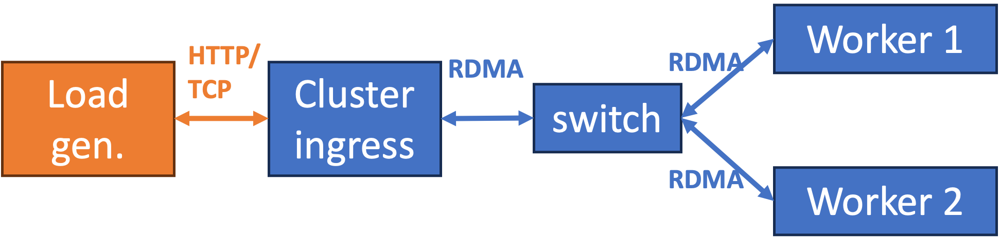

## About

**NADINO** is a research prototype for high-performance, DPU-accelerated serverless networking. NADINO consists of two main components:
* **[NADINO Ingress](https://github.com/ucr-serverless/nadino-ingress.git):** an NGINX-based ingress that offloads protocol conversion and communication to RDMA and F-Stack.
* **[NADINO Network Engine](https://github.com/ucr-serverless/nadino-network-engine.git):** a DPU-enabled network engine that orchestrates RDMA flows and enables function chaining with low CPU overhead.

---

## Table of Contents

* [Testbed](#testbed)
* [Installation](#installation)
  * [Ingress](#nadino-ingress)
  * [Network Engine](#network-engine)
* [Running Online Boutique](#running-online-boutique)
* [Sample Experiments](#sample-experiments)
* [License](#license)

---

## Testbed

- **Tested OS**: Ubuntu 22.04 with kernel 5.15.
- **Reference topology**: You will need at least four nodes in your cluster. Two nodes are used as worker nodes to deploy user functions. One node is used to deploy NADINO ingress. The remaining node is used for load generation. A sample topology is shown below:

    

- **NIC/DPU Requirement**:
    - NADINO ingress requires **two** NICs: One [DPDK-compatible NIC](https://core.dpdk.org/supported/nics/) for F-stack and one RDMA (Mellanox/NVIDIA ConnectX) NIC.
    - Worker nodes require a NVIDIA BlueField DPU to deploy NADINO DNE. CNE runs on the host CPU without a DPU.

> We recommend using [`r7525`](https://docs.cloudlab.us/hardware.html) nodes on CloudLab with our customized [network profile](https://www.cloudlab.us/p/KKProjects/dpu-same-lan).

---

## Installation

Clone NADINO and initialize submodules:

   ```bash
   git clone --recursive https://github.com/ucr-serverless/NADINO.git
   cd NADINO
   git submodule update --init --recursive
   ```


### NADINO Ingress

> Full installation guide: nadino-ingress/README.md

Key steps:

1. Install build dependencies (`flex`, `bison`, `libssl-dev`, `libelf-dev`, `libnuma-dev`, `libconfig-dev`, `uuid-dev`, `libpcre3-dev`, `libglib2.0-dev`, etc.) and DOCA 2.10.0.
2. Build DPDK 21.11 and F-stack (install DOCA before this step so the mlx5 PMD is compiled in).
3. Configure hugepages and NIC binding — PCIe `pci_whitelist` for Mellanox; `igb_uio` for Intel.
4. Build RDMA lib, DOCA lib, and NADINO Ingress:

    ```bash
    cd ~/NADINO/nadino-ingress/

    # Build RDMA lib
    cd RDMA_lib && make && cd ..

    # Build DOCA lib
    cd DOCA_lib && meson /tmp/doca_lib && ninja -C /tmp/doca_lib && cd ..

    # Build DPDK
    cd ./f-stack/dpdk/
    meson setup -Denable_kmods=true build
    ninja -C build
    sudo ninja -C build install
    cd ~/NADINO/nadino-ingress/

    # Build f-stack

    export FF_PATH=~/NADINO/nadino-ingress/f-stack
    export PKG_CONFIG_PATH=/usr/lib64/pkgconfig:/usr/local/lib64/pkgconfig:/usr/lib/pkgconfig
    cd ~/NADINO/nadino-ingress/f-stack/lib/
    make -j
    sudo make install
    cd ~/NADINO/nadino-ingress/

    # Build and install NADINO Ingress
    cd ~/NADINO/nadino-ingress/
    FF_PATH=~/NADINO/nadino-ingress/f-stack \
    PKG_CONFIG_PATH=/usr/lib64/pkgconfig:/usr/local/lib64/pkgconfig:/usr/lib/pkgconfig \
        ./configure --prefix=/usr/local/nginx_fstack --with-ff_module
    python ./scripts/patch_make.py
    FF_PATH=~/NADINO/nadino-ingress/f-stack \
    PKG_CONFIG_PATH=/usr/lib64/pkgconfig:/usr/local/lib64/pkgconfig:/usr/lib/pkgconfig \
        make -j
    sudo make install
    ```
*NOTE: if you encounter compilation errors when compiling DOCA_lib, it may because there are older build artifacts under the `/tmp/doca_lib`, you can use `sudo rm -rf /tmp/doca_lib` to remove it and retry again.*

5. Configure `conf/f-stack.conf` (DPDK port and hugepage settings), `conf/nginx.conf` (worker count, location blocks), and `conf/rdma.cfg` (RDMA device, backend IP/port, GID index — read at runtime, no recompile needed). Run `sudo make install` after editing config files.

---

### Network Engine

> Full installation guide: nadino-network-engine/README.md

Key steps:

1. Install Drivers on host and DPU. Specifically, DOCA 2.10.0 on each host node. For DPU setup, see the BlueField2 DPU Setup Guide at `./nadino-network-engine/docs/BlueField2-DPU-Setup-Guide.md`.

2. Run environment setup scripts to install libbpf, DPDK RTE libraries, and configure hugepages:

    ```bash
    cd ~/NADINO/nadino-network-engine
    bash sigcomm-experiment/env-setup/001-env_setup_master.sh
    bash sigcomm-experiment/env-setup/002-env_setup_master.sh
    ```

3. Build RDMA lib, DOCA lib, and Network Engine:

    ```bash
    cd ~/NADINO/nadino-network-engine
    meson setup build
    ninja -C build/ -v
    ```

All components are launched via `run.sh` (run as root, in order):

| Component | Command | Notes |
|-----------|---------|-------|
| Shared memory manager | `sudo ./run.sh shm_mgr <cfg>` | Start first on each node |
| Sockmap manager | `sudo ./run.sh sockmap_manager` | |
| DPU gateway | `sudo ./run.sh gateway <cfg>` | DNE: runs on BlueField DPU |
| Network function | `sudo ./run.sh <service_name> <nf_id>` | One process per function |

---

## Running Online Boutique

This section shows how to deploy the **Online Boutique** microservices workload using the DNE across the four-node topology shown in the [Testbed](#testbed) diagram above.

> **Config file:** `nadino-network-engine/cfg/ae_online-boutique-palladium-dpu.cfg`
>
> Use `tmux` or `byobu` to manage multiple panes. All `run.sh` commands must be run as root from the `nadino-network-engine/` directory.

### Startup Order

Start components in this order — each component must be fully up before proceeding to the next step:

1. Shared memory manager — **Worker 1**
2. Sockmap manager — **Worker 1**
3. Network functions — **Worker 1**
4. Shared memory manager — **Worker 2**
5. Sockmap manager — **Worker 2**
6. Network functions — **Worker 2**
7. Gateway — **DPU 1** (attached to Worker 1)
8. Gateway — **DPU 2** (attached to Worker 2)
9. NADINO Ingress — **Ingress node** (see [nadino-ingress](https://github.com/ucr-serverless/nadino-ingress))
10. Generate load using wrk - **Load gen node**

---

Two tmux setup scripts are provided to pre-fill all commands across 16 panes. Run from the
project root on each host:

```bash
# On worker1 host
cd ~/NADINO/nadino-network-engine/
./scripts/tmux_dne_host1.sh
```

```bash
# On worker2 host
cd ~/NADINO/nadino-network-engine/
./scripts/tmux_dne_host2.sh
```

These commands will open a tmux windows with commands prefilled on the *Host* side. You can execute them in order. *Remember you still need to open a window to DPU and execute gateway there*

### Worker 1 (host)

```bash
cd ~/NADINO/nadino-network-engine

# Step 1 — shared memory manager
sudo ./run.sh shm_mgr ./cfg/ae_online-boutique-palladium-dpu.cfg

# Step 2 — sockmap manager
sudo ./run.sh sockmap_manager

# Step 4 — network functions
sudo ./run.sh frontendservice       1
sudo ./run.sh recommendationservice 5
sudo ./run.sh checkoutservice       7
```

### DPU 1 (attached to Worker 1)

```bash
cd ~/NADINO/nadino-network-engine

# Step 3 — DPU gateway
sudo ./run.sh gateway ./cfg/ae_online-boutique-palladium-dpu.cfg
```

### Worker 2 (host)

```bash
cd ~/NADINO/nadino-network-engine

# Step 5 — shared memory manager
sudo ./run.sh shm_mgr ./cfg/ae_online-boutique-palladium-dpu.cfg

# Step 6 — sockmap manager
sudo ./run.sh sockmap_manager

# Step 8 — network functions
sudo ./run.sh currencyservice       2
sudo ./run.sh productcatalogservice 3
sudo ./run.sh cartservice           4
sudo ./run.sh shippingservice       6
sudo ./run.sh paymentservice        8
sudo ./run.sh emailservice          9
sudo ./run.sh adservice            10
```

### DPU 2 (attached to Worker 2)

```bash
cd ~/NADINO/nadino-network-engine

# Step 7 — DPU
sudo ./run.sh gateway ./cfg/ae_online-boutique-palladium-dpu.cfg
```

### Ingress node

```bash
# Step 9 — start NADINO Ingress
sudo /usr/local/nginx_fstack/sbin/nginx -g "daemon off;"
```

### Load Generator node

Send load to the ingress node (replace `<INGRESS_IP>` with the ingress node's IP):

```bash
# Cart endpoint
wrk -t1 -c50 -d10s http://10.10.1.3:80/rdma/1/cart -H "Connection: Close"

# Default (homepage) endpoint
wrk -t1 -c50 -d10s http://10.10.1.3:80/rdma/1/ -H "Connection: Close"

# Product endpoint
wrk -t1 -c50 -d10s "http://10.10.1.3:80/rdma/1/product?1YMWWN1N4O" -H "Connection: Close"
```

*NOTE*: For the `./cfg/ae_online-boutique-palladium-dpu.cfg`, the `<INGRESS_IP>` is `10.10.1.3`. If your ingress use different IP, you should change it accordingly.

*NOTE*: run different commands one by one and be patient and wait wrk print the request rate result.

---

## Sample Experiments

### Running with a Dummy Function Chain
See [Dummy Function Chain Setup](docs/DUMMY.md) for details.

---

## License

* Cluster Ingress: BSD 3-Clause (with Apache-2.0 modifications)
* NADINO Network Engine: Apache License 2.0

See individual `LICENSE` files for details.
